# ☢️ markdown-RBMK

**Your GitHub activity, rendered as an RBMK reactor core.** A self-contained,
animated SVG badge for your profile README — no JavaScript runtime, no canvas,
no GIF encoding. Just one `` tag.

<p align="center">
  
</p>

Every cell is a fuel channel. The center runs hottest. A faint flux animation
keeps the core alive — and because it is pure SVG + SMIL, it animates straight
inside a GitHub README.

---

## Modes

Pick what your reactor runs on with the `mode` parameter.

### ☢️ `commit` — contribution heatmap _(default)_

Each cell is a day; colour is commit intensity (idle → hot), the number is that
day's commit count. The instrument panel reports totals, active/idle days and
your peak day.


### 🧪 `language` — language rings

Concentric rings sized by language share — your most-used language fills the
core. The panel lists the fuel channels with exact percentages.



### ⚛️ `hybrid` — commit core + language rim

A commit heatmap core wrapped in an outer ring of your top languages, with both
readouts on one panel.



---

## Quick start

### Hosted badge — public repositories

Drop this in your README and swap in your username:

```md

```

Query parameters:

| Param      | Values                          | Default   |
| ---------- | ------------------------------- | --------- |
| `username` | any GitHub username             | required  |
| `mode`     | `commit` · `language` · `hybrid`| `commit`  |
| `theme`    | `dark` · `light`                | `dark`    |
| `maxRepos` | `1`–`100`                       | `100`     |

Examples:

```md


```

> The hosted endpoint only ever reads **public** data. For private repositories,
> use the GitHub Action below.

### GitHub Action — public + private, commits the SVG

The Action runs in your own workflow, so it can read private repositories and
commit the rendered SVG into your repo:

```yaml
name: Reactor core
on:
  schedule: [{ cron: '0 0 * * *' }] # refresh daily
  workflow_dispatch:
jobs:
  reactor:
    runs-on: ubuntu-latest
    permissions:
      contents: write
    steps:
      - uses: actions/checkout@v4
      - uses: Seungpyo1007/markdown-rbmk/packages/action@v1
        with:
          username: ${{ github.repository_owner }}
          mode: commit
        env:
          GITHUB_TOKEN: ${{ secrets.GITHUB_TOKEN }}
      - run: |
          git config user.name  github-actions
          git config user.email github-actions@github.com
          git add reactor-core.svg
          git diff --cached --quiet || git commit -m "chore: update reactor core"
          git push
```

Then embed the committed file:

```md

```

For private repositories, pass a Personal Access Token (`repo` + `read:user`)
and set `scope: all`:

```yaml
        with:
          username: ${{ github.repository_owner }}
          mode: hybrid
          scope: all
        env:
          GITHUB_TOKEN: ${{ secrets.MY_PAT }}
```

Action inputs: `username`, `mode`, `scope`, `theme`, `max_repos`, `output_path`.

---

## How it works

- **Pure string SVG.** The badge is built by concatenating SVG markup — no
  headless browser, no `canvas`, no `sharp`. It renders anywhere an ``
  works.
- **SMIL animation.** Each cell pulses on its own seeded clock, so the core
  shimmers without a single line of JavaScript.
- **Deterministic.** A username seeds a PRNG, so the same user always gets the
  same badge — numbers and animation timing included.
- **Transparent background.** The badge adapts to GitHub's light and dark
  themes automatically.
- **`commit` / `hybrid`** read the GitHub contribution calendar (GraphQL);
  **`language`** sums repository language bytes (REST).

---

## Development

Requires Node 20+ and pnpm.

```sh
pnpm install
pnpm test                # run the test suite
pnpm preview             # render examples/ from fake data into packages/core/preview-*.svg
```

End-to-end render against the real GitHub API:

```sh
GITHUB_TOKEN=$(gh auth token) \
  pnpm --filter @markdown-rbmk/core exec tsx scripts/e2e.ts <username>
```

### Project structure

```
markdown-rbmk/
├── packages/
│   ├── core/      # stats, contributions, grid, RNG, SVG renderer
│   ├── server/    # Vercel function — GET /api/badge
│   └── action/    # GitHub Action
├── examples/      # sample badges (this README's images)
└── pnpm-workspace.yaml
```

---

## License

[MIT](LICENSE). Language colours adapted from
[github-linguist](https://github.com/github-linguist/linguist) (MIT).
