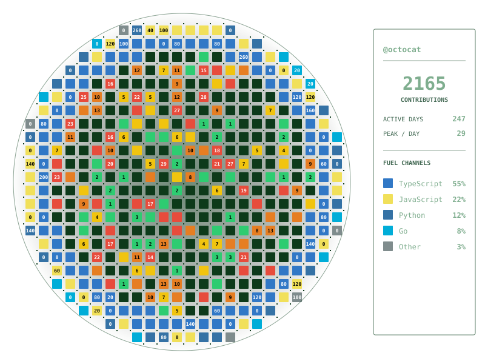
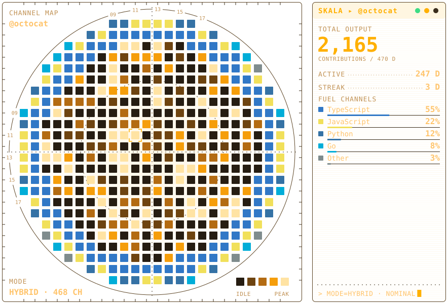
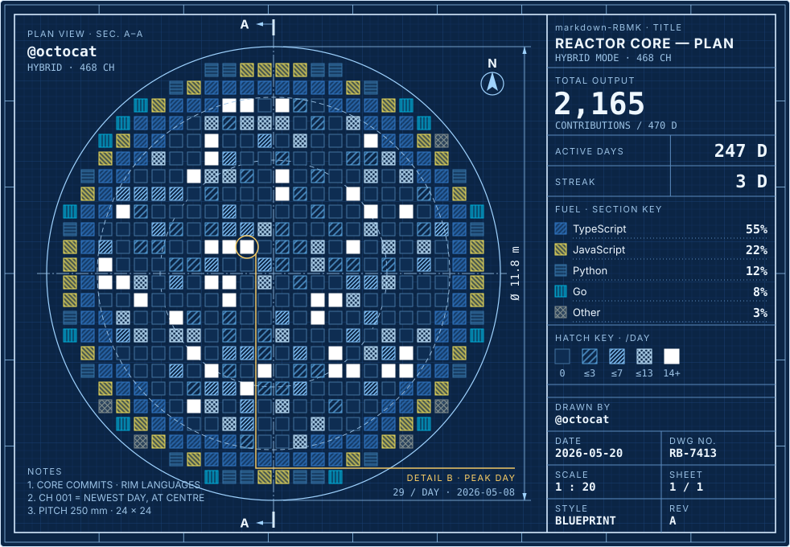
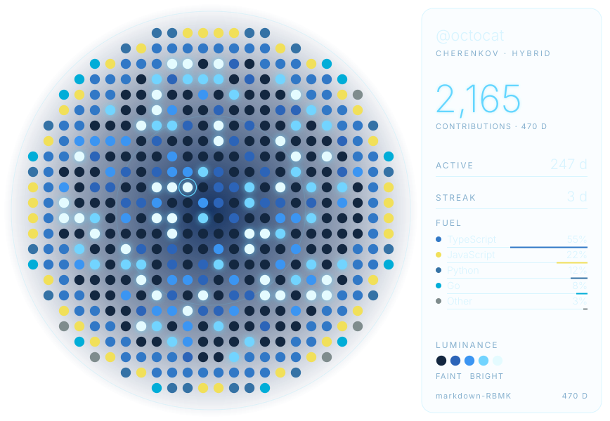
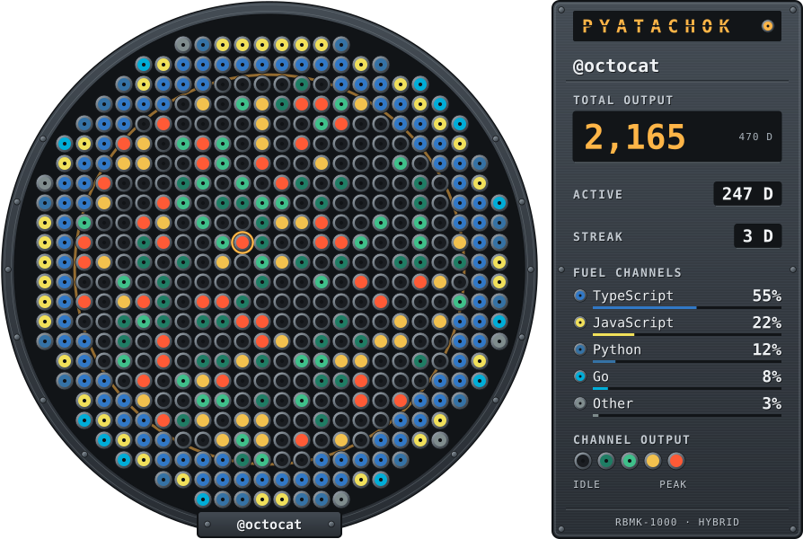
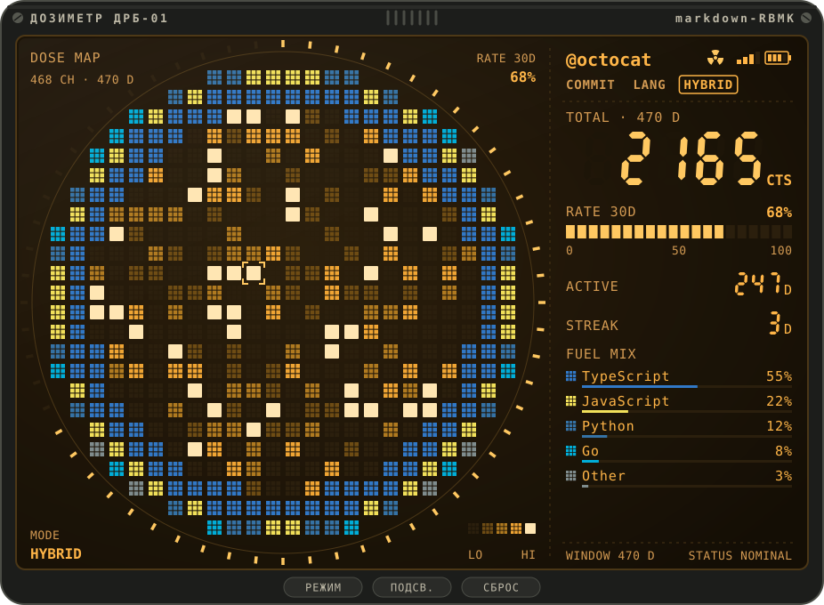
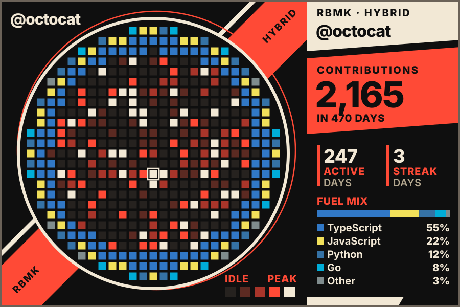
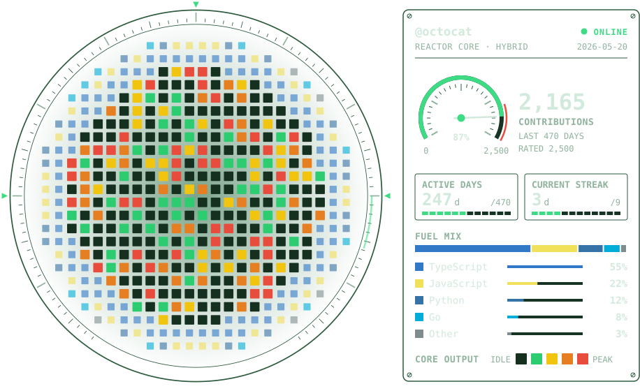
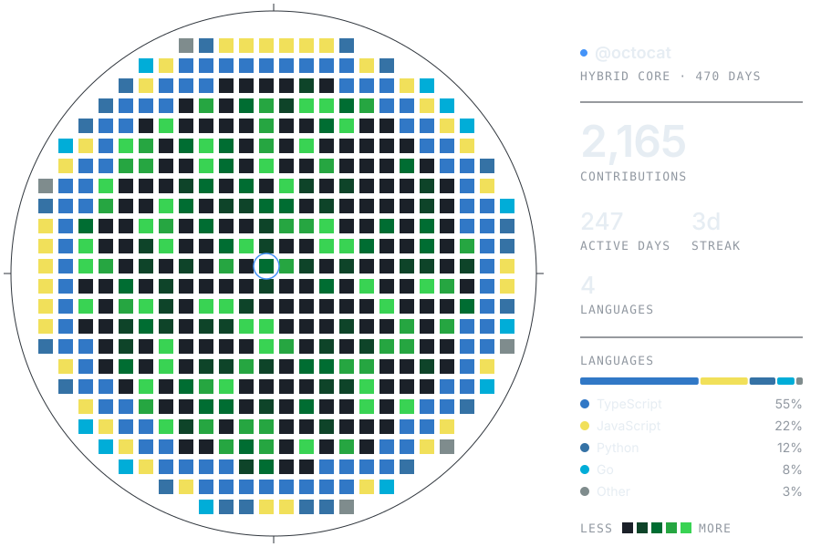

# ☢️ markdown-RBMK

<p align="center">
  <a href="https://github.com/Seungpyo1007/markdown-rbmk/actions/workflows/ci.yml"></a>
  <a href="LICENSE"></a>
  <a href="https://markdown-rbmk.vercel.app"></a>
  
</p>

**Your GitHub activity, rendered as an RBMK reactor core.** A self-contained,
animated SVG badge for your profile README — no JavaScript runtime, no canvas,
no GIF encoding. Just one `` tag, in nine styles.

<p align="center">
  <a href="https://markdown-rbmk.vercel.app"></a>
</p>

Every cell is a fuel channel. The centre runs hottest. A faint flux animation
keeps the core alive — pure SVG, so it animates straight inside a GitHub README.

> 🎛️ **[Open the style studio →](https://markdown-rbmk.vercel.app)** — pick a
> style, tune the core and its panel, watch it re-render live, and copy the Markdown.

---

## Styles

Pick a look with `&style=<name>`. Leaving it out gives `classic`, the original
badge — **existing embeds never change**.

| | |
|:-:|:-:|
| <br>`classic` — the original (default) | <br>`skala` — control-room CRT console |
| <br>`blueprint` — engineering drawing | <br>`cherenkov` — blue reactor-pool glow |
| <br>`pyatachok` — steel reactor lid | <br>`dosimeter` — handheld LCD counter |
| <br>`poster` — constructivist geometry | <br>`gauge` — analog instrument panel |
| <br>`minimal` — quiet and GitHub-native | |

<sub>Thumbnails use demo data. Your badge shows your own activity.</sub>

Every style takes `theme=dark` or `theme=light`, plus one extra preset of its own:

| Style | Extra preset |
| --- | --- |
| `skala` · `dosimeter` | `green` |
| `blueprint` | `sepia` |
| `cherenkov` | `abyss` |
| `pyatachok` | `oxide` |
| `poster` | `cobalt` |
| `gauge` · `minimal` | `cherenkov` |

### Split the core and the panel

The styles can draw just the reactor or just the instrument panel, so you can
lay them out however your README wants:

```md


```

---

## Modes

Pick what your reactor runs on with `mode` (works with every style).

- ☢️ **`commit`** _(default)_ — a contribution heatmap. Each cell is a day, newest
  at the centre; colour is commit intensity.
- 🧪 **`language`** — concentric rings sized by language share; your most-used
  language fills the core.
- ⚛️ **`hybrid`** — a commit core wrapped in a rim of your top languages.

---

## Quick start

### Hosted badge — public repositories

```md

```

Build the URL in the [studio](https://markdown-rbmk.vercel.app), or by hand:

| Param      | Values                                             | Default   |
| ---------- | -------------------------------------------------- | --------- |
| `username` | any GitHub username                                | required  |
| `style`    | `classic` or a style above                         | `classic` |
| `mode`     | `commit` · `language` · `hybrid`                   | `commit`  |
| `theme`    | `dark` · `light` · the style's extra preset        | `dark`    |
| `days`     | `30`–`728` recent days (commit · hybrid)           | `470`     |
| `langs`    | `1`–`8` languages before “Other”                   | `4`       |
| `exclude`  | comma-separated languages to leave out             | none      |
| `forks`    | `true` · `false` — count forked repos              | `false`   |
| `archived` | `true` · `false` — count archived repos            | `true`    |
| `maxRepos` | `1`–`100` repositories scanned                     | `100`     |

These apply to the named styles (`classic` ignores them):

| Param    | Values                                                     | Default   |
| -------- | ---------------------------------------------------------- | --------- |
| `view`   | `full` · `core` · `panel`                                  | `full`    |
| `panel`  | `right` · `bottom` — where the panel sits (and its shape)  | `right`   |
| `cell`   | `default` · `square` · `round` · `circle` · `hex`          | `default` |
| `anim`   | `on` · `off` (a static SVG)                                | `on`      |
| `accent` | hex colour, e.g. `ff8800`                                  | style's   |
| `heat`   | five hex colours: `idle,h1,h2,h3,h4`                       | style's   |
| `stats`  | ordered list from `total,active,idle,peak,streak,longest,languages` | style's |

Invalid values quietly fall back to their default, so a typo never breaks the
image. Examples:

```md
<!-- blueprint on sepia vellum, hex cells -->


<!-- cherenkov, hybrid, panel below, only three readouts -->


<!-- poster with your own heat ramp and no animation -->

```

> The hosted endpoint only ever reads **public** data. For private repositories,
> use the GitHub Action below. Badges are cached for up to a day.

### GitHub Action — public + private, commits the SVG

The Action runs in your own workflow, so it can read private repositories and
commit the rendered SVG into your repo:

```yaml
name: Reactor core
on:
  schedule: [{ cron: '0 0 * * *' }] # refresh daily
  workflow_dispatch:
jobs:
  reactor:
    runs-on: ubuntu-latest
    permissions:
      contents: write
    steps:
      - uses: actions/checkout@v7
      - uses: Seungpyo1007/markdown-rbmk/packages/action@v2
        with:
          username: ${{ github.repository_owner }}
          style: skala
          mode: hybrid
        env:
          GITHUB_TOKEN: ${{ secrets.GITHUB_TOKEN }}
      - run: |
          git config user.name  github-actions
          git config user.email github-actions@github.com
          git add reactor-core.svg
          git diff --cached --quiet || git commit -m "chore: update reactor core"
          git push
```

Then embed the committed file: ``.

For private repositories, pass a Personal Access Token (`repo` + `read:user`)
and set `scope: all` (`env: GITHUB_TOKEN: ${{ secrets.MY_PAT }}`).

Every hosted parameter is also an Action input, in snake_case (`max_repos`);
see [`action.yml`](packages/action/action.yml). Extra inputs: `scope`
(`public` · `all`), `output_path` (default `reactor-core.svg`), and `max_repos`
goes up to `1000`. `@v1` keeps working and renders `classic`.

---

## How it works

- **Pure string SVG.** Built by concatenating markup — no headless browser, no
  `canvas`, no `sharp`. It renders anywhere an `` works.
- **Calm animation, no JavaScript.** `classic` uses SMIL; the named styles use
  CSS keyframes and stop completely under `prefers-reduced-motion`.
- **Deterministic.** A username seeds a PRNG, so the same user always gets the
  same badge.
- **Real data only.** `commit` / `hybrid` read the contribution calendar
  (GraphQL); `language` sums repository language bytes (REST, at most 8
  requests in flight).
- **Stable forever.** Existing badge URLs are pinned by golden snapshot tests;
  every style is checked by a conformance suite (valid SVG, no scripts or
  external resources, accessible title, contrast, size).

---

## Development

Requires Node 24 and pnpm 10 (`corepack enable` picks the pinned version).

```sh
pnpm install
pnpm test                          # vitest: goldens + style conformance
pnpm -r exec tsc --noEmit -p tsconfig.json
pnpm preview "days=90&langs=6"     # render all modes from fake data
pnpm build:fn                      # bundle the Vercel function
```

Styles live in `packages/core/src/styles/<name>.ts`; each is one pure function
from a shared, real-data model to an SVG string.

The hosted cache is optional: set `UPSTASH_REDIS_REST_URL` /
`UPSTASH_REDIS_REST_TOKEN` (or the legacy `KV_REST_API_*` names) to enable it.

---

## License

[MIT](LICENSE). Language colours adapted from
[github-linguist](https://github.com/github-linguist/linguist) (MIT).
